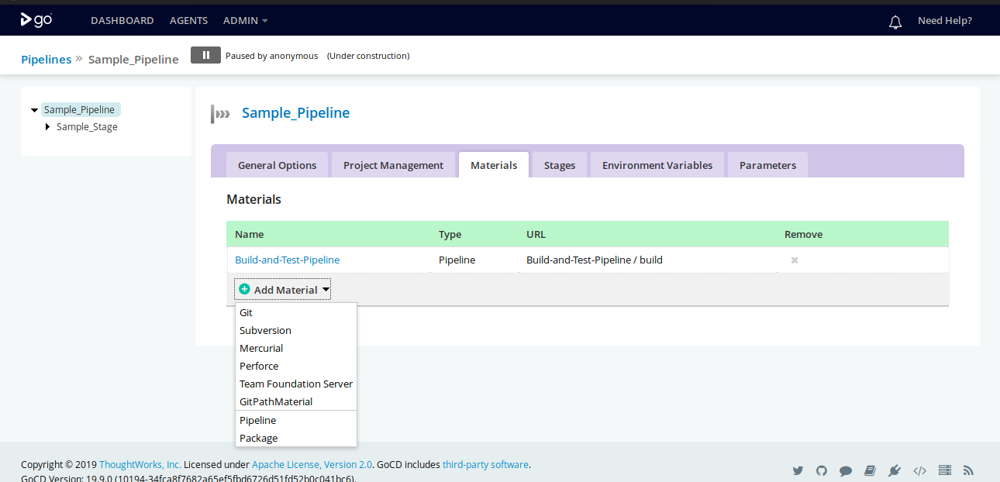

# gocd-git-path-material-plugin

GoCD plugin to introduce a material, that watches on a sub-directory of git repository. 




[](https://snap-ci.com/TWChennai/gocd-git-path-material-plugin/branch/master)


### Installation

Have a look [here](https://docs.go.cd/current/extension_points/plugin_user_guide.html)

**Known bug/feature:** After plugin installation, you will be able to see *GitPathMaterial* as a material type only in edit. So add a git material when you add new pipeline, edit to add new *GitPathMaterial* and remove the old one. 


### Contributing

#### Build

execute the following command to build the plugin

```bash
./gradlew clean build
```

#### Docker

You can quickly test the plugin using Docker, ensure you have installed docker, refer [docker installation guide](https://www.docker.com/products/overview) for installing docker for different environments

Execute the following gradle task to start the go-server
```bash
./gradlew clean startGoCd
```

You can now access the [go-server via port 8153](http://localhost:8153)

#### reload

If you like to reload the go-server with new build run,
```bash
./gradlew clean restartGoCd
```

#### stop

You can stop the running docker instance with the following gradle task
```bash
./gradlew clean stopGoCd
```
